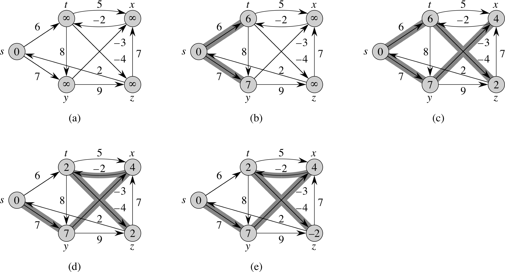
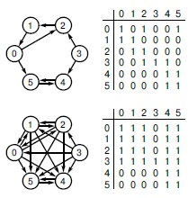

# GraphAlgorithms
<h4>Floyd-Worshel, Bellman-Ford and other algos for my study stuff</h4>

Hello eveone, this is my PyQt5 project for some study-practice
there are Deikstra, Bellman-Ford and Floyd-Worshel algoritms. Them has been realised by 
# Installation 

## TO RUN this you should: 
1) Make an virtual enviroment 
   `python -m venv venv`
   
2) Activate virtual enviroment
   `venv\Scripts\activate`
   or if you run on Linux
   `$ source venv/bin/activate`
   
3) Install some nessesary libs:

`pip install PyQt5` 

`pip install loguru` 

`pip install pyqt5-tools`

`pip install numpy`
   
3) Run the main.py file

Enjoy!

## TO BUILT this you should run the command in project folder (also you need to install a pyinstaller lib):
   `pyinstaller --onefile --icon=myicon.ico --windowed main.py`
   
   Then, after some time in <i>./build</i> folder you may find <b>main.exe</b> file

# Examples of algos 

### This is an example what Bellman-Ford algo should do

### An example for Floyd-Worshel algo

### Deikstra algo

